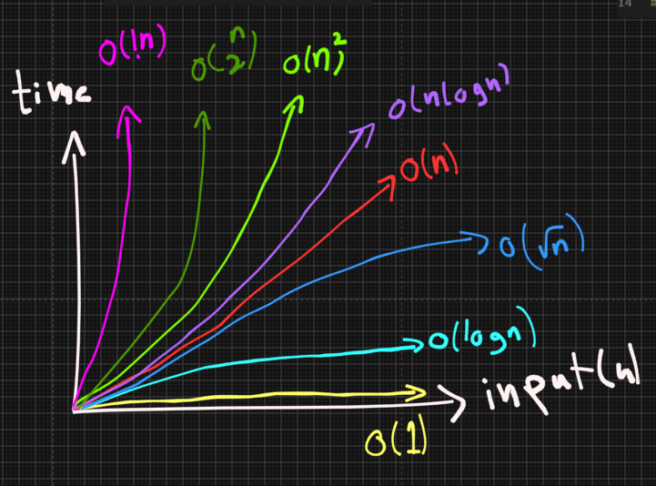

# Software Engineering Revisited

A personal revision hub for software engineering topics, built with React + Vite.
Topics are listed in a sidebar on the left; each one will get its own content page.

## Topics

- Data Structures (more to come)

### Big-O Complexity



## Getting started

```bash
npm install
npm run dev
```
